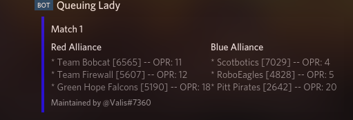

# Qualbot
Various tools used by FRC 5160 ([The Chargers](https://www.thebluealliance.com/team/5160)) to improve scouting efficiency at tournaments

## Webhooks
### Queuing Lady


Queuing Lady is a webhook that's designed to produce useful embeds for Discord alerting people about upcoming matches.

### Configuration
By default all webhooks are configured through `config.json`, although if you want you can change that everywhere as needed.
These are built to be run on fairly specific hardware although it's entirely possible for you to modify it to your needs.
#### Example `config.json` syntax
```json
{
    "webhooks": {
        "queuing-lady": {
            "discord-id": "[REDACTED]",
            "discord-token": "[REDACTED]",
            "tba": "[REDACTED]",
            "debugging-matches": true,
            "event-data": {
                "name": "ncwak",
                "year": 2019,
                "match-type": "qm"
            },
            "sending-delay": 60,
            "hook-data": {
                "last-sent": 0,
                "last-sent-b64": ""
            }
        }
    },
    "logging": {
        "log-file": "log.txt"
    }
}
```
