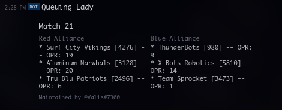

# Qualbot
Various tools used by FRC 5160 ([The Chargers](https://www.thebluealliance.com/team/5160)) to improve scouting efficiency at tournaments

## Webhooks
### Queuing Lady


Queuing Lady is a webhook that's designed to produce useful embeds for Discord alerting people about upcoming matches.

Queuing Lady needs to have a few extra lines added to the config:
```json
"hook": {
    "tba": "",
    "event-data": {
        "name": "ncwak",
        "year": 2020,
        "match-type": "qm"
    },
    "debugging-matches": false
}
```

## Configuration
All webhooks are configured through `config.json` in the root directory.
There are some base hook configurations, for a hook derived off something else (like queuing-lady), you'll need to add a bit more to the config structure for the data taken by it.

Example `config.json` structure for a discord webhook
```json
"discord-hook": {
    "discord-id": "",
    "discord-token": "",
    "sending-delay": 0,
    "hook-data": {
        "last-sent": 0,
        "last-sent-b64": ""
    }
}
```

Example `config.json` structure for a slack webhook
```json
"slack-hook": {
    "slack-url": "",
    "sending-delay": 0,
    "hook-data": {
        "last-sent": 0,
        "last-sent-b64": ""
    }
}
```

This is also required for the logging and everything to work -- just change `logging` to wherever you want the log file to be. 
```json
"logging": {
    "log-file": "log.txt"
}
```
